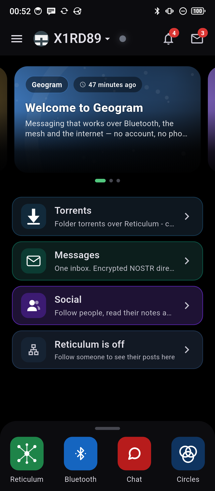
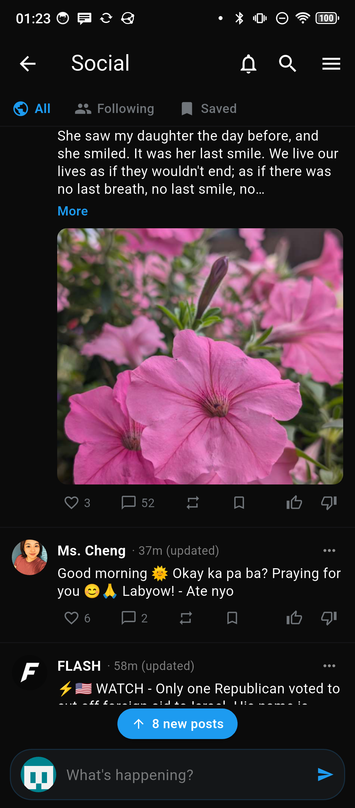
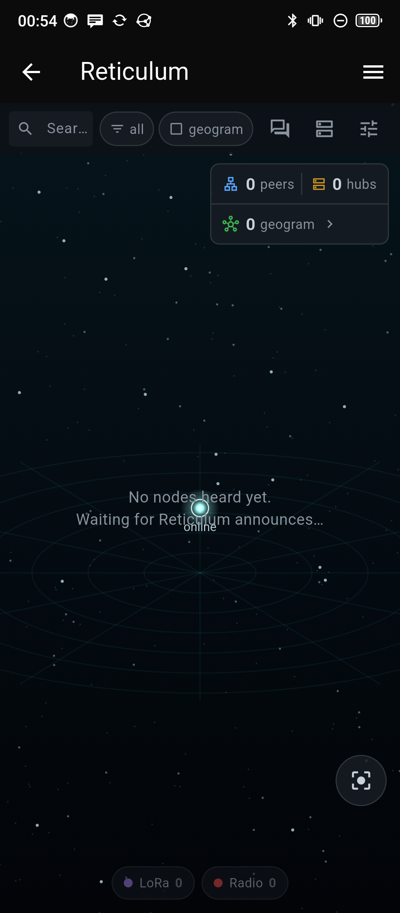
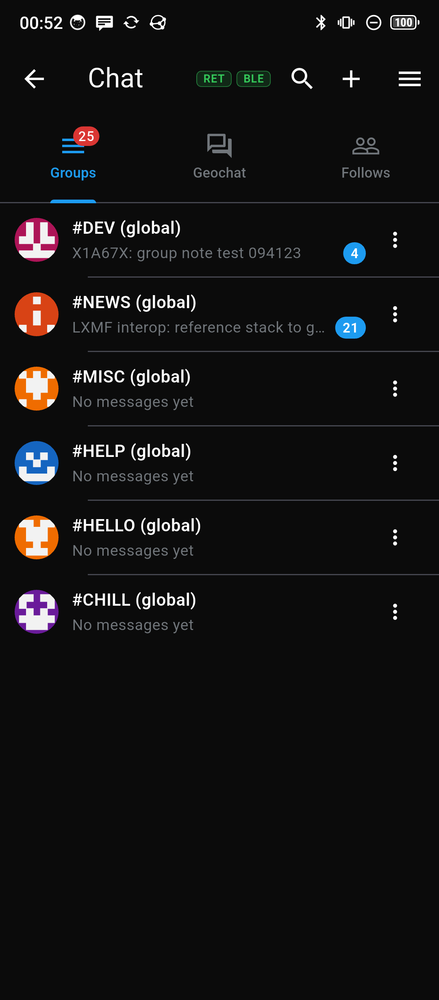
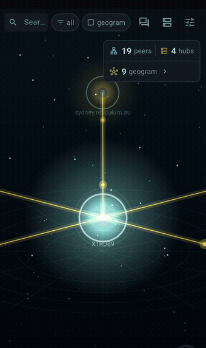
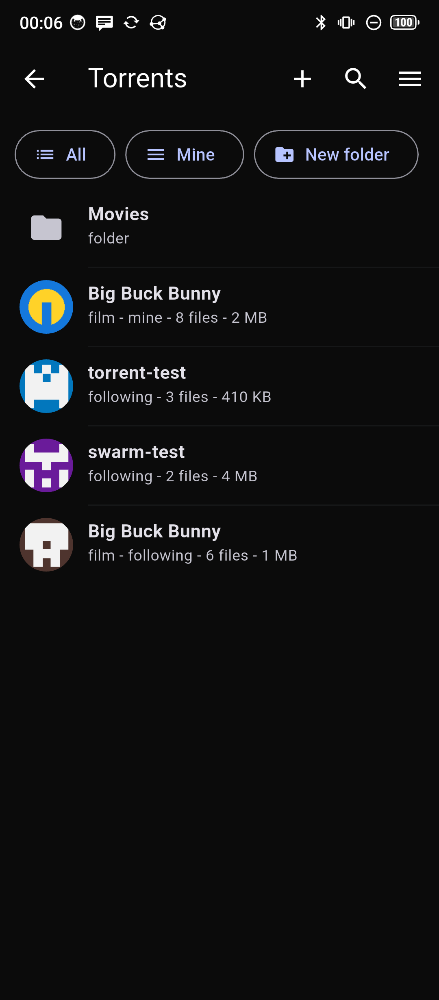
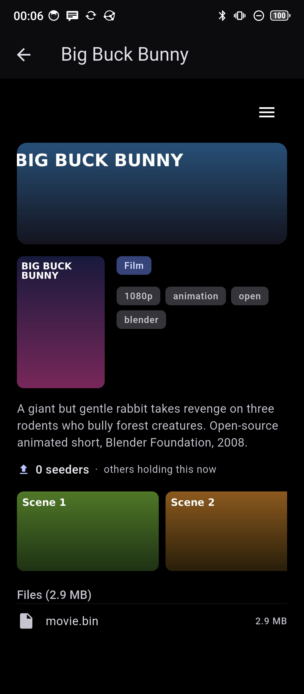

# Geogram

Geogram is a messenger and app launcher that works off the grid. It talks over
the internet, over a [Reticulum](docs/reticulum-connections.md) overlay, and
straight over [Bluetooth LE](docs/ble.md), and it stitches those together so a
message or a file gets to the other side over whatever path happens to be up. If
there is no internet, it falls back to a Bluetooth street mesh and long range
radio. If there is internet, it uses it. There are no accounts, no phone number,
and no server in the middle.

On top of that, Geogram runs "wapps": small WebAssembly apps that draw through
one shared native UI and use the host's transports. This page walks through the
four main ones: Chat, Social, Reticulum, and Torrents.

<p align="center">
  
  
  
</p>

## Download

The latest stable build:

| Platform | Download |
|----------|----------|
| Linux (x64) | [Geogram for Linux (.tar.gz)](https://github.com/geograms/aurora/releases/latest/download/aurora-linux-x64.tar.gz) |
| Windows (x64) | [Geogram for Windows (installer)](https://github.com/geograms/aurora/releases/latest/download/aurora-windows-x64-setup.exe) |
| Android | [Geogram for Android (.apk)](https://github.com/geograms/aurora/releases/latest/download/aurora.apk) |

Every build, betas included, is on the
[releases page](https://github.com/geograms/aurora/releases). macOS builds from
source (see [Build & run](#build--run)).

## What it does

- **Many transports at once.** A message can go out over the internet, over
  Bluetooth LE, or over [Reticulum](docs/reticulum-connections.md)/LXMF, and
  anything coming in is tagged with the path it arrived on (`NET`, `BLE`,
  `RET`/`RNS`, `RLY`). Whichever copy shows up first wins, and the duplicates get
  dropped.
- **It keeps working with no internet.** A [Bluetooth street mesh](docs/mesh.md)
  passes messages from phone to phone with nothing in between, and cheap **LoRa**
  dongles push that reach out over kilometres. A phone that does have internet
  will quietly relay its Bluetooth-only and LoRa neighbours onto the wider
  Reticulum network, so a device that is off the grid can still be reached from
  anywhere.
- **Your device is the server.** There is no backend. Each phone keeps, serves,
  and re-seeds its own data. Your identity, messages, files, and posts live on the
  devices that made them, and the network is just the wire between them.
- **Identity is a key you own.** Every station has a Nostr keypair (secp256k1) and
  announces its public key now and then, which is enough to sign messages and to
  encrypt them end to end without any directory to look people up in. Your private
  key never leaves the device, and it is backed up behind an emoji passphrase.
- **Files are named by their contents.** Media and files are referenced by their
  `sha256`, found through a Kademlia DHT that runs over Reticulum, and re-seeded by
  everyone who downloads them.
- **Runs everywhere.** Linux, Windows, macOS, and Android, with an in-app Update
  Center (stable and beta channels) for over-the-air updates.

## The wapps

Wapps are small WebAssembly apps that borrow Geogram's native UI and its
transports. All of the app-specific code lives in the wapp, so a wapp can update
on its own without a fresh install of Geogram. Four of them ship in the box.

### Chat

<p align="center">
  
</p>

Encrypted messages to anyone nearby over Bluetooth, or to anyone in the world over
Reticulum. Group channels like `#DEV`, `#NEWS`, and `#HELP` are either global
(followed everywhere) or local (only seen inside your map radius). One-to-one
chats are encrypted to the other person's key and signed, so nobody can put words
in your mouth. The app bar shows which transports are alive right now (`RET`,
`BLE`), and two more tabs put a **Geochat** map of the stations near you and a
**Follows** roster behind the same panel. Messages take the Bluetooth mesh or
Reticulum/LXMF, whichever gets there.

### Social

<p align="center">
  
</p>

A public feed built on Nostr. Post short notes with photos and video, follow people
by their key, like and reply, and read three tabs: **All** (a global stream pulled
from whatever relays your device can reach), **Following** (just the people you
follow), and **Saved**. Posts are `kind-1` notes and profiles are `kind-0`,
carried over Reticulum and fetched straight from the author for the people you
follow. Nobody runs a feed in the middle deciding what you get to see, and
everything you post is signed with your own key.

### Reticulum

<p align="center">
  
</p>

A live picture of the Reticulum network the way your device hears it, drawn
natively and off the UI thread. You get a radar of **peers**, **hubs**, and other
**geograms**, with **LoRa** and **Radio** counters along the bottom. Filter by
network, tap through the devices you can reach (each with its callsign and public
key), fire off an **LXMF direct message** to any of them, and even open
**NomadNet** pages over the mesh. It only ever shows what has actually announced
itself to this node. There is no master list of the network anywhere.

### Torrents

<p align="center">
  
  
</p>

A torrent client where the thing you share is a whole **folder**, named by a key
(`ntorrent1...`) instead of a fixed content hash. That means the publisher can
change what is inside and the link still works. The files within stay named by
their `sha256` and are [checked on the way in](docs/torrents.md). When you
download a torrent, its files land as real files on your disk, and your device
then seeds them to other people. Pin one to keep a full copy. Each listing carries
a title, a category, tags, cover art, and a little favicon.

The info page shows the folder's total size and how many other devices are holding
it right now, read from a cached snapshot so opening the page does not wait on the
network. Because a folder can change under you, a **Get updates** switch lets you
freeze the copy you have and stop pulling the publisher's changes, which is handy
when you are watching your data. Share a torrent by link or by **QR code**
(scanning works on Android). The publisher's identity stays out of the link unless
they choose to add it, since an unsigned name in a link is just bait.

> The other wapps in the box include **Messages** (one encrypted Nostr inbox),
> **Circles** (private group chat with keys that rotate), a media **Player**, and
> the **Wapp Store**.

## Indexers, archivers, and no server anywhere

There is no server behind any of this. The network is only ever user devices, and
a device can take on one of two extra jobs if it wants to:

- **Indexers** are the trackers. When a device holds a folder or a file, it
  publishes a small pointer that says "this address has folder F" or "this address
  has file sha", and indexers keep those pointers and answer searches. That is how
  a downloader finds who has something without a central catalog. Indexers only
  ever hold pointers, never the files.
- **Archivers** keep the bytes around. They accept files that peers hand them and
  mirror the folders they follow, so content stays reachable even when the person
  who first shared it is offline. Anyone who downloads is already half an archiver,
  because they re-seed what they got.

Put those together and every phone is its own little host. Your posts, your files,
and your torrents are served by your device and by whoever chose to mirror them,
not by a company. Take the rest of the network away and your device still holds,
serves, and checks its own data.

## Privacy

Reticulum makes it hard to watch people in bulk:

- **No IP addresses.** A Reticulum address is a 16-byte destination hash, not an
  IP. The old routine of scraping a swarm for IP addresses and mailing out threats
  has nothing to scrape.
- **Everything is encrypted.** Links are encrypted end to end with forward secrecy.
  Hubs and relays move bytes for you but never see what is inside them.
  One-to-one messages are encrypted to the other person's key, and groups use keys
  that rotate.
- **Keys, not names.** Identities are Nostr keys. A torrent's folder key is a
  separate thing from your personal identity, and the publisher's `npub` is left
  out of a shared link by default, so a listing does not have to point back at a
  person.
- **We are honest about the limits.** In any swarm, the one thing you cannot hide
  is who is holding what, because that is how downloaders find seeders. Reticulum
  keeps that a pseudonym instead of an IP, but it is not full anonymity against
  someone who joins the network and watches the pointers. [`docs/torrents.md`](docs/torrents.md)
  spells out the whole picture and where it is heading next.

## How it reaches people

```
        +----------------------------------------------------------+
        |          Wapps  (Chat, Social, Reticulum, Torrents)      |
        +---------------+------------------------------+-----------+
                        |                              |
              message transport               file transport / discovery
        +---------------+-----------+    +-------------+-------------------+
        |  Reticulum / LXMF         |    |  Reticulum links               |
        |  Bluetooth mesh + LoRa    |    |  + DHT       (find by hash)    |
        |  internet                 |    |  + Indexers  (find by text)    |
        +---------------+-----------+    +-------------+-------------------+
                        |                              |
                        +--------------+---------------+
                              +--------+---------+
                              |   Reticulum RNS   |
                              | TCP/UDP/BLE/LoRa  |
                              +-------------------+
```

- **Messages** go over the Bluetooth mesh, LoRa, the internet, or Reticulum/LXMF,
  whichever is up.
- **Files** are named by their hash inside a message and moved separately over
  Reticulum, the DHT, a LAN, or BitTorrent.
- **Reticulum** is what lets two devices on different networks find each other. The
  DHT and the indexers are the decentralized ways to look up who has a file, with
  nothing central.

The networking layers are written up with file and line pointers into the code
under [`docs/`](docs/README.md):
[reticulum-connections](docs/reticulum-connections.md), [ble](docs/ble.md),
[mesh](docs/mesh.md), [torrents](docs/torrents.md), and [circles](docs/circles.md).

## Build & run

Geogram is a Flutter app, and the Reticulum stack is a pure-Dart package sitting
next to it.

```sh
flutter pub get
flutter run -d linux        # or windows / macos
```

Android:

```sh
./launch-android.sh         # build + install on a connected device
```

The wapps that ship with the app live in `assets/wapps/`. To rebuild one from
source, see the [`geograms/wapps`](https://github.com/geograms/wapps) repo.

## Development

> **Put new features in a wapp, not the engine, unless you really cannot.** A wapp
> updates in place: people get it through the Wapp Store, or it ships as a small
> `.wapp` with no reinstall. Changing the core engine means a whole new APK that the
> user has to download and install, which on Android drags in signed updates,
> versionCode bumps, and a slow rollout (see [Validation](docs/validation.md)). So a
> wapp is the default home for anything new. Touch the engine only when the feature
> honestly cannot live in a wapp, like a new transport, a HAL primitive a wapp needs
> but cannot express, or a host service that cuts across everything. Keep the host
> generic: app-specific rules (Chat conventions, social logic, torrent formats) go
> in the wapp's C and GeoUI, never in `lib/`. Most changes belong in
> [`geograms/wapps`](https://github.com/geograms/wapps), not here.

These documents set out how code is written and accepted here. Read the one that
covers your area before you touch it. They are the rules, not just notes.

- **[Validation](docs/validation.md)** is the bar for "done": a task counts only
  after it has been driven end to end on a real Android phone, with real taps and a
  screenshot that shows it working. It also covers keeping honest status messages
  going and chasing a reported bug through the whole flow instead of stopping at the
  first thing that breaks.
- **[Performance](docs/performance.md)** covers where Aurora spends CPU and memory,
  what got fixed and how it was measured, and in section 8 the rules for adding work
  without making it worse: keep heavy work off the UI thread, survive a suspended
  Android phone with the foreground service and native heartbeat, reuse the
  `BackgroundService` template, drive wapps on a timer through the event bus, and
  never trust the network (transfers resume, idle links close, liveness gets swept
  every tick).
- **[Notifications](docs/notifications.md)** covers how any wapp or host code raises
  a notification, the severity and scope types, and how they turn into system
  notifications on desktop and Android.
- **[Reusable services](docs/reusable.md)** lists the shared host services (event
  bus, notifications, storage, and so on) to build on instead of reinventing.
