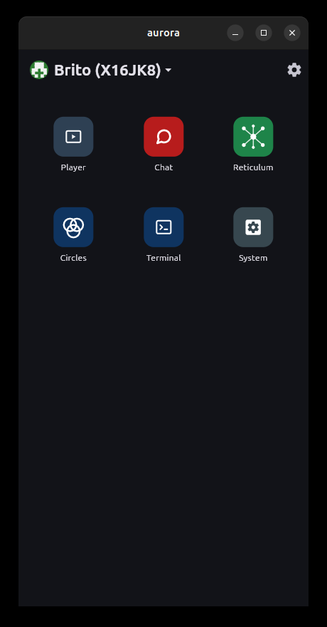
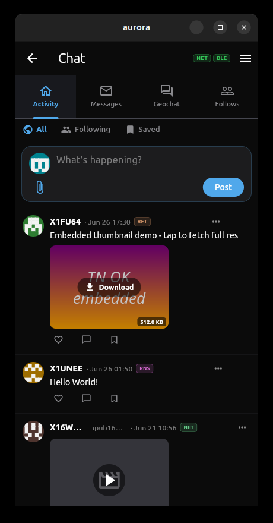
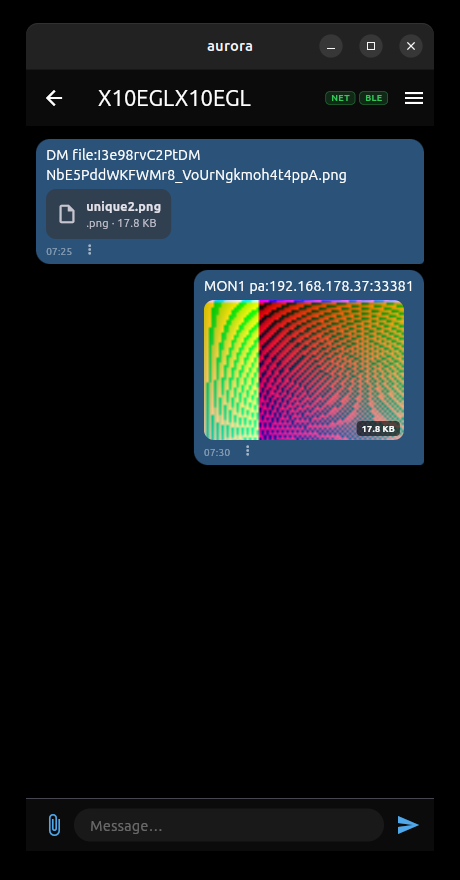
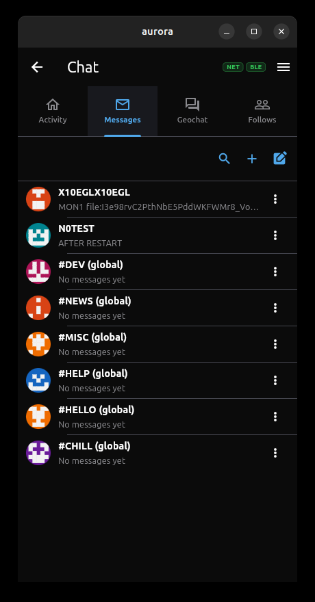
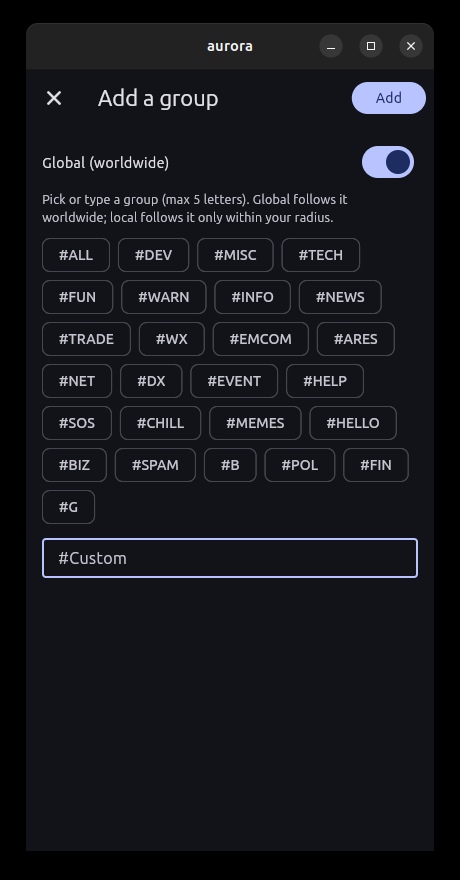
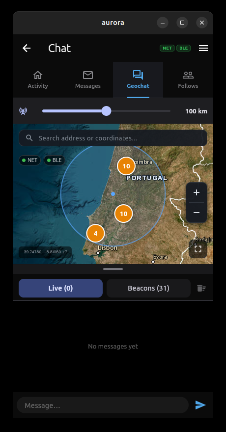

# Aurora

**Aurora is an off-grid-first messenger and app launcher.** It speaks several
networks at once — the internet, a [Reticulum](docs/reticulum-connections.md) overlay, the
[APRS](docs/aprs.md) network, and direct [Bluetooth LE](docs/ble.md) — and glues
them together so a message or a file reaches the other side over whatever path
is available. When there's no internet, it falls back to radio and Bluetooth;
when there is, it uses it. No accounts, no central server.

On top of that transport core, Aurora is a **launcher for "wapps"** —
sandboxed WebAssembly apps that render through a shared native UI. The flagship
wapp, **Chat**, is shown throughout this README as an example of what the
platform does.

<p align="center">
  
  
  
</p>

---

## What it does

- **Multi-transport messaging** — one message goes out over internet (APRS-IS),
  Bluetooth LE, or Reticulum/LXMF, and incoming messages are tagged with the
  path they arrived on (`NET`, `BLE`, `RET`/`RNS`, `RLY`).
- **Off-grid by design** — APRS over radio and connectionless BLE broadcast keep
  working with no internet at all. A phone with internet automatically
  **bridges** its BLE-only peers onto the Reticulum hubs, so an offline device
  stays reachable worldwide.
- **Decentralized identity** — every station has a Nostr keypair (secp256k1) and
  periodically announces its public key, enabling **signed** and
  **end-to-end-encrypted** 1:1 messages without any directory server.
- **Content-addressed files** — media and files are referenced by `sha256` hash,
  found through a Kademlia DHT over Reticulum, and re-seeded by every downloader.
- **Wapp platform** — install/run sandboxed WebAssembly apps (Chat, Reticulum,
  Circles, Player, Terminal, …) that share one native UI and the host's
  transports.
- **Cross-platform** — Linux, Windows, macOS, Android. In-app Update Center
  (stable / beta channels) for OTA updates.

---

## The Chat wapp — a tour

Aurora's main app is **Chat**: a full messaging station that puts an Activity
feed, 1:1 and group messaging, a live map, and a follow roster behind one panel.

### Launcher


Wapps are grouped on the home screen; the red **Chat** tile opens the messenger.
The profile pill (top-left) carries your callsign and a deterministic identicon.

### Activity feed


A public, Twitter-style stream of the people you follow. Posts carry text,
embedded media thumbnails, like / reply / save actions, a transport badge per
post, and a three-dot menu to **block** or **mute** an author.

### Messages — 1:1 and groups



Direct chats and `#`-prefixed group channels in one list. `(global)` groups are
followed worldwide; local groups only within your map radius. Fresh installs are
seeded with global groups (`#DEV`, `#NEWS`, `#HELP`, …) and every contact gets a
generated identicon.

<p align="center">
  
  
</p>

Join a group from preset chips or a custom tag (left). Inside a chat (right),
messages have timestamps, file attachments, and inline content-addressed images;
1:1 DMs are encrypted to the recipient's key when known, and can be signed.

### Geochat — live map



A live map of stations and geotagged messages around you. The range slider sets
your filter radius; pins cluster nearby beacons. Position, status, emergency and
timed beacons are composed and broadcast from here.

### Follows


Manage who you follow and who follows you; following a callsign streams their
public Activity into your feed.

---

## How it reaches people

```
            ┌─────────────────────────────────────────────────────────┐
            │                     Aurora chat (wapps)                  │
            │   APRX message conventions  +  file: media references    │
            └───────────────┬───────────────────────┬─────────────────┘
                            │                       │
                 message transport          file transport / discovery
                 ┌──────────┴──────────┐    ┌────────┴───────────────┐
                 │  APRS-IS    BLE      │    │  Reticulum links        │
                 │  (TNC2)   (compact)  │    │  + DHT (find by hash)   │
                 │                      │    │  + relay (find by text) │
                 └──────────────────────┘    └────────┬───────────────┘
                                                      │
                                              ┌───────┴────────┐
                                              │  Reticulum RNS  │
                                              │ TCP/UDP/BLE/Auto│
                                              └─────────────────┘
```

- **Messages** ride APRS (internet APRS-IS or off-grid BLE) and Reticulum/LXMF.
- **Files** are *referenced* by content hash inside messages and *transferred*
  out of band over Reticulum, the DHT, a LAN, or BitTorrent.
- **Reticulum** is the transport that lets two devices on different networks
  reach each other; the **DHT** is the decentralized index that finds *who holds
  a file* with no central server. Hubs relay bytes only — they never see content.

The protocol/networking layers are documented with file/line pointers into the
code under [`docs/`](docs/README.md):
[reticulum-connections](docs/reticulum-connections.md), [aprs](docs/aprs.md),
[ble](docs/ble.md), [aprx](docs/aprx.md), [circles](docs/circles.md).

---

## Build & run

Aurora is a Flutter app; the Reticulum stack is a pure-Dart sibling package.

```sh
flutter pub get
flutter run -d linux        # or windows / macos
```

Android:

```sh
./launch-android.sh         # build + install on a connected device
```

The bundled wapps live in `assets/wapps/`. To rebuild a wapp from source, see
the [`geograms/wapps`](https://github.com/geograms/wapps) repository.
