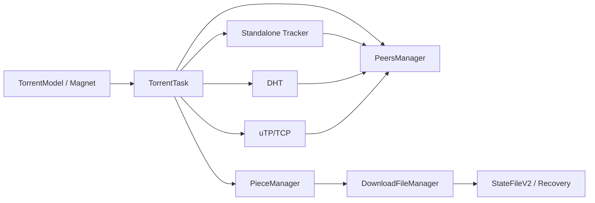

# About

Dart library for implementing BitTorrent client.

> [!IMPORTANT]
> Tracker/common/DHT internals are fully standalone in this repository.

> [!TIP]
> For quick onboarding, start with [How to use](#how-to-use), then jump to [Using Magnet Links](#using-magnet-links).

## Quick Navigation

| Section                                                          | Description                                 |
| ---------------------------------------------------------------- | ------------------------------------------- |
| [About](#about)                                                  | High-level package overview                 |
| [BEP Support](#bep-support)                                      | Implemented BEP specifications              |
| [How to use](#how-to-use)                                        | Minimal setup and first download            |
| [Examples](#examples)                                            | Runnable examples from `example/`           |
| [Automated Publishing](#automated-publishing)                    | GitHub Actions + pub.dev trusted publishing |
| [Local Quality Gates](#local-quality-gates)                      | Format, fixes, analyze, tests, coverage     |
| [Feature Cookbook](#feature-cookbook)                            | Short practical snippets by capability      |
| [WebTorrent Compatibility](#webtorrent-compatibility)            | WebTorrent magnets and WSS trackers         |
| [Using Magnet Links](#using-magnet-links)                        | Metadata-first magnet workflow              |
| [Download UX Automation](#download-ux-automation)                | File moving, auto-move, scheduling, RSS     |
| [Move Files While Downloading](#move-files-while-downloading-51) | Move/rebind files during active task        |
| [Auto-move Downloaded Files](#auto-move-downloaded-files-52)     | Rule-based destination routing              |
| [Scheduling](#scheduling-53)                                     | Time windows and rate control               |
| [RSS/Atom Auto-download](#rssatom-auto-download-54)              | Feed subscriptions and queue integration    |
| [Advanced Features](#advanced-features)                          | Streaming, queue, proxy, scrape, filtering  |
| [Selected Files (BEP 0053)](#selected-files-bep-0053)            | Download specific file indices              |
| [Tracker Scrape (BEP 48)](#tracker-scrape-bep-48)                | Seeder/leecher/download counters            |
| [Proxy Support](#proxy-support)                                  | HTTP/SOCKS5 tracker/peer proxying           |
| [Torrent Queue Management](#torrent-queue-management)            | Priorities, concurrency, progression        |
| [Port Forwarding](#port-forwarding)                              | UPnP/NAT-PMP                                |
| [IP Filtering](#ip-filtering)                                    | CIDR, eMule dat, PeerGuardian               |
| [Superseeding (BEP 16)](#superseeding-bep-16)                    | Seeder efficiency mode                      |
| [File Priority Management](#file-priority-management)            | high/normal/low/skip                        |
| [Built-in Torrent Parser](#built-in-torrent-parser)              | Parse v1/v2/hybrid without external deps    |
| [Monitoring and Error Tracking](#monitoring-and-error-tracking)  | Runtime diagnostics                         |
| [Features](#features)                                            | Full capability summary                     |

<details>
<summary>Architecture Snapshot</summary>



</details>

The Dart Torrent client consists of several parts:

- [Bencode](https://pub.dev/packages/b_encode_decode)
- Built-in tracker stack (`lib/src/standalone/dtorrent_tracker`) - no external dependency required since 0.4.9
- Built-in DHT stack (`lib/src/standalone/dht/standalone_dht.dart`) - no external dependency required
- [Built-in Torrent parser](https://github.com/atlet99/dtorrent_task_v2/blob/main/lib/src/torrent/torrent_parser.dart) (TorrentParser/TorrentModel) - no external dependency required since 0.4.8
- Built-in common utilities (`lib/src/standalone/dtorrent_common`) - no external dependency required since 0.4.9
- [UTP](https://pub.dev/packages/utp_protocol)

This package implements the regular BitTorrent Protocol and manages the above packages to work together for downloading.

## BEP Support

- [BEP 0003 The BitTorrent Protocol Specification](https://www.bittorrent.org/beps/bep_0003.html)
- [BEP 0005 DHT Protocol](https://www.bittorrent.org/beps/bep_0005.html)
- [BEP 0006 Fast Extension](https://www.bittorrent.org/beps/bep_0006.html)
- [BEP 0007 IPv6 Tracker Extension](https://www.bittorrent.org/beps/bep_0007.html)
- [BEP 0009 Extension for Peers to Send Metadata Files](https://www.bittorrent.org/beps/bep_0009.html)
- [BEP 0010 Extension Protocol](https://www.bittorrent.org/beps/bep_0010.html)
- [BEP 0011 Peer Exchange (PEX)](https://www.bittorrent.org/beps/bep_0011.html)
- [BEP 0012 Multitracker Metadata Extension](https://www.bittorrent.org/beps/bep_0012.html)
- [BEP 0014 Local Service Discovery](https://www.bittorrent.org/beps/bep_0014.html)
- [BEP 0015 UDP Tracker Protocol](https://www.bittorrent.org/beps/bep_0015.html)
- [BEP 0016 Superseeding](https://www.bittorrent.org/beps/bep_0016.html)
- [BEP 0019 HTTP/FTP Seeding (GetRight-style)](https://www.bittorrent.org/beps/bep_0019.html)
- [BEP 0023 Tracker Returns Compact Peer Lists](https://www.bittorrent.org/beps/bep_0023.html)
- [BEP 0024 Tracker Returns External IP](https://www.bittorrent.org/beps/bep_0024.html)
- [BEP 0027 Private Torrents](https://www.bittorrent.org/beps/bep_0027.html)
- [BEP 0029 uTorrent transport protocol](https://www.bittorrent.org/beps/bep_0029.html)
- [BEP 0031 Failure Retry Extension](https://www.bittorrent.org/beps/bep_0031.html)
- [BEP 0032 IPv6 Extension for DHT](https://www.bittorrent.org/beps/bep_0032.html)
- [BEP 0040 Canonical Peer Priority](https://www.bittorrent.org/beps/bep_0040.html)
- [BEP 0041 UDP Tracker Protocol Extensions](https://www.bittorrent.org/beps/bep_0041.html)
- [BEP 0043 Read-only DHT Nodes](https://www.bittorrent.org/beps/bep_0043.html)
- [BEP 0044 Storing arbitrary data in the DHT](https://www.bittorrent.org/beps/bep_0044.html)
- [BEP 0045 Multiple-address operation for the DHT](https://www.bittorrent.org/beps/bep_0045.html)
- [BEP 0047 Padding Files and File Attributes](https://www.bittorrent.org/beps/bep_0047.html)
- [BEP 0048 Tracker Scrape Extension](https://www.bittorrent.org/beps/bep_0048.html)
- [BEP 0050 Pub/Sub over DHT](https://www.bittorrent.org/beps/bep_0050.html)
- [BEP 0051 DHT Infohash Indexing](https://www.bittorrent.org/beps/bep_0051.html)
- [BEP 0052 BitTorrent v2](https://www.bittorrent.org/beps/bep_0052.html)
- [BEP 0053 Magnet URI extension - Select specific file indices](https://www.bittorrent.org/beps/bep_0053.html)
- [BEP 0054 The lt_donthave extension](https://www.bittorrent.org/beps/bep_0054.html)
- [BEP 0055 Holepunch extension](https://www.bittorrent.org/beps/bep_0055.html)

## How to use

This package no longer requires the external `dtorrent_parser` dependency (built-in since 0.4.8):

```yaml
dependencies:
  dtorrent_task_v2: ^0.5.4
```

Current documented release: `0.5.4`.

This release focuses on WebTorrent-style magnet compatibility (`ws://`/`wss://`
trackers and `xs` exact-source URLs), safer standalone tracker internals, and
faster local quality gates.

Download from: [DTORRENT_TASK_V2](https://pub.dev/packages/dtorrent_task_v2)

Import the library:

```dart
import 'package:dtorrent_task_v2/dtorrent_task_v2.dart';
```

First, create a `TorrentModel` from a .torrent file:

```dart
  var model = await TorrentModel.parse('some.torrent');
```

Second, create a `Torrent Task` and start it:

```dart
  var task = TorrentTask.newTask(model, 'savepath');
  await task.start();
```

You can add event listeners to monitor `TorrentTask` execution:

```dart
  EventsListener<TaskEvent> listener = task.createListener();
  listener
    ..on<TaskCompleted>((event) {
      print('Download completed!');
    })
    ..on<TaskFileCompleted>((event) {
      print('File completed: ${event.file.originalFileName}');
    })
    ..on<TaskStopped>((event) {
      print('Task stopped');
    });
```

And there are methods to control the `TorrentTask`:

```dart
   // Stop task:
   await task.stop();
   // Pause task:
   task.pause();
   // Resume task:
   task.resume();
```

## Examples

For pub.dev and local onboarding, start from:

- `example/example.dart` - full feature tour (magnet, WebTorrent-style magnets, queue, RSS, proxy, filtering, encryption, DHT, sequential presets)
- `example/file_moving_example.dart` - move files while downloading (`moveDownloadedFile`, `detectMovedFiles`)
- `example/auto_move_example.dart` - auto-move rules by extension
- `example/scheduling_example.dart` - time-window scheduling and speed limits
- `example/rss_auto_download_example.dart` - RSS/Atom subscription and queue auto-download
- `example/torrent_queue_example.dart` - queue priorities and concurrent download limits
- `example/proxy_example.dart` - HTTP/SOCKS5 proxy setup
- `example/tracker_scrape_example.dart` - scrape statistics (BEP 48)
- `example/ip_filtering_example.dart` - CIDR and blocklist usage
- `example/port_forwarding_example.dart` - UPnP/NAT-PMP mapping
- `example/sequential_streaming_example.dart` - streaming-oriented sequential strategy
- `example/superseeding_example.dart` - BEP 16 superseeding flow

Run:

```bash
dart run example/example.dart
dart run example/file_moving_example.dart <path-to-torrent>
dart run example/auto_move_example.dart <path-to-torrent>
dart run example/scheduling_example.dart <path-to-torrent>
dart run example/rss_auto_download_example.dart <rss-feed-url>
```

## Automated Publishing

Automated publishing is configured with:

- GitHub Actions workflow: `.github/workflows/publish.yml`
- OIDC authentication (no long-lived pub.dev token secret)
- Tag-triggered publish flow (`v*.*.*`)

Manual one-time setup on pub.dev:

1. Open package admin page: `https://pub.dev/packages/dtorrent_task_v2/admin`.
2. In **Automated publishing**, enable **GitHub Actions**.
3. Set repository to `atlet99/dtorrent_task_v2`.
4. Set tag pattern to `v{{version}}`.
5. Optional hardening: require GitHub Actions environment `pub.dev` and then uncomment `environment: pub.dev` in workflow.

Release flow:

1. Update `version` in `pubspec.yaml`.
2. Commit changes to default branch.
3. Push tag matching the version:
   `git tag v0.5.4 && git push origin v0.5.4`
4. Check workflow run in GitHub Actions and audit log on pub.dev.

## Local Quality Gates

The project includes a Makefile for repeatable local checks:

| Command            | Purpose                                                          |
| ------------------ | ---------------------------------------------------------------- |
| `make check-all`   | Install deps, apply Dart fixes, format Dart/Markdown, analyze    |
| `make test-all`    | Run the full test suite once with coverage output                |
| `make fix-dry-run` | Preview analyzer-backed `dart fix` changes                       |
| `make format-all`  | Format tracked/project Dart files with safety excludes           |
| `make analyze-all` | Run Dart analyzer and Flutter analyzer when Flutter is available |
| `make test-file`   | Run one test file via `FILE=test/name_test.dart`                 |
| `make test-name`   | Run one named test via `TEST_NAME="..."`                         |

`dart fix` uses the analyzer context, so ignored folders are managed in
`analysis_options.yaml`. Generated and non-project directories such as
`test_results/`, `tmp/`, `coverage/`, `build/`, `.dart_tool/`, and
`test_download_*/` are excluded from analysis/fix flows.

Coverage is written to `coverage/` by default. Override it when needed:

```bash
make test-all COVERAGE_DIR=tmp/coverage
```

## Feature Cookbook

### Queue + Priority

```dart
final queueManager = QueueManager(maxConcurrentDownloads: 2);
queueManager.addToQueue(
  TorrentQueueItem(
    metaInfo: torrentA,
    savePath: './downloads/a',
    priority: QueuePriority.high,
  ),
);
queueManager.addToQueue(
  TorrentQueueItem(
    metaInfo: torrentB,
    savePath: './downloads/b',
    priority: QueuePriority.normal,
  ),
);
```

### File Selection + Priority (BEP 53 + file priorities)

```dart
task.applySelectedFiles([0, 2, 5]); // download only selected files
task.setFilePriority(0, FilePriority.high);
task.setFilePriority(1, FilePriority.skip);
```

### Tracker Scrape (BEP 48)

```dart
final result = await task.scrapeTracker('https://tracker.example/announce');
if (result.success) {
  print(result.stats);
}
```

### Proxy + IP Filter

```dart
final proxy = ProxyConfig.socks5(host: '127.0.0.1', port: 1080);
final filter = IPFilter()..addCIDRFromString('10.0.0.0/8');

final task = TorrentTask.newTask(
  torrent,
  './downloads',
  false,
  null,
  null,
  null,
  proxy,
)
  ..setIPFilter(filter);
```

### Encryption Policy (BEP 8 oriented)

```dart
const encryption = ProtocolEncryptionConfig(
  level: EncryptionLevel.prefer,
  enableStreamEncryption: true,
  enableMessageObfuscation: true,
);
```

### DHT Data Modules (BEP 44/50/51)

```dart
import 'dart:convert';

final storage = DHTStorage();
final target = storage.putImmutable(utf8.encode('hello'));

final pubsub = DHTPubSub();
pubsub.publish(topic: 'releases', payload: utf8.encode('v1.0'));

final indexer = DHTInfohashIndexer();
indexer.index(infoHash: '0123...', name: 'Example Linux ISO');
```

## WebTorrent Compatibility

`0.5.3` adds the first WebTorrent compatibility layer for Dart VM usage:

- `MagnetParser` accepts WebTorrent-style magnets with mixed `udp://` and
  `wss://` trackers.
- Web seed (`ws`) and exact-source (`xs`) URLs are preserved from magnet links.
- `WebSocketTracker` supports `ws://` and `wss://` tracker announce signalling.
- Tracker responses can carry WebTorrent signalling metadata such as peer IDs,
  offers, answers, ICE data, and WebTorrent peer payloads.
- Local regression tests cover well-known Sintel and Big Buck Bunny WebTorrent
  magnet fixtures.

Example:

```dart
const torrentId =
    'magnet:?xt=urn:btih:dd8255ecdc7ca55fb0bbf81323d87062db1f6d1c'
    '&dn=Big+Buck+Bunny'
    '&tr=udp%3A%2F%2Ftracker.opentrackr.org%3A1337'
    '&tr=wss%3A%2F%2Ftracker.openwebtorrent.com'
    '&ws=https%3A%2F%2Fwebtorrent.io%2Ftorrents%2Fbig-buck-bunny.mp4';

final magnet = MagnetParser.parse(torrentId);
if (magnet == null) {
  throw ArgumentError('Invalid magnet link');
}

final websocketTrackers =
    magnet.trackers.where((uri) => uri.scheme == 'ws' || uri.scheme == 'wss');

print('WebTorrent trackers: ${websocketTrackers.length}');
print('Web seeds: ${magnet.webSeeds}');
print('Exact sources: ${magnet.exactSources}');
```

Current scope: WebTorrent-style magnet parsing and WebSocket tracker signalling
are supported. Browser WebRTC peer transport and service-worker streaming are
separate future layers.

## Using Magnet Links

The library supports downloading from magnet links with automatic metadata download:

```dart
import 'package:dtorrent_task_v2/dtorrent_task_v2.dart';

// Parse magnet link
final magnet = MagnetParser.parse('magnet:?xt=urn:btih:...');
if (magnet == null) {
  print('Invalid magnet URI');
  return;
}

// Download metadata first
final metadata = MetadataDownloader.fromMagnet('magnet:?xt=urn:btih:...');
final metadataListener = metadata.createListener();

metadataListener
  ..on<MetaDataDownloadProgress>((event) {
    print('Metadata progress: ${(event.progress * 100).toInt()}%');
  })
  ..on<MetaDataDownloadComplete>((event) {
    print('Metadata downloaded!');
    // Parse torrent from metadata
    final msg = decode(event.data);
    final torrentMap = <String, dynamic>{'info': msg};
    final torrentModel = parseTorrentFileContent(torrentMap);

    if (torrentModel != null) {
      // Start download with web seeds and selected files from magnet link
      final task = TorrentTask.newTask(
        torrentModel,
        'savepath',
        false, // stream
        magnet.webSeeds.isNotEmpty ? magnet.webSeeds : null,
        magnet.acceptableSources.isNotEmpty ? magnet.acceptableSources : null,
      );

      // Apply selected files from magnet link (BEP 0053)
      if (magnet.selectedFileIndices != null &&
          magnet.selectedFileIndices!.isNotEmpty) {
        task.applySelectedFiles(magnet.selectedFileIndices!);
      }

      await task.start();

      // Transfer peers from metadata downloader to avoid reconnection delays
      final metadataPeers = metadata.activePeers;
      for (var peer in metadataPeers) {
        task.addPeer(peer.address, PeerSource.manual, type: peer.type);
      }

      // Add trackers from magnet link
      if (magnet.trackers.isNotEmpty) {
        final infoHashBuffer = Uint8List.fromList(
          List.generate(magnet.infoHashString.length ~/ 2, (i) {
            final s = magnet.infoHashString.substring(i * 2, i * 2 + 2);
            return int.parse(s, radix: 16);
          }),
        );
        for (var trackerUrl in magnet.trackers) {
          task.startAnnounceUrl(trackerUrl, infoHashBuffer);
        }
      }
    }
  });

metadata.startDownload();
```

## Download UX Automation

The latest release adds automation features for download workflow management.

### Move Files While Downloading (5.1)

```dart
// Move one torrent file to a new absolute path.
await task.moveDownloadedFile(
  torrentFilePath: 'season1/episode1.mkv',
  newAbsolutePath: '/Volumes/Media/Shows/episode1.mkv',
);

// Detect files moved outside of the client and re-bind paths from state.
await task.detectMovedFiles();
```

### Auto-move Downloaded Files (5.2)

```dart
task.configureAutoMove(
  AutoMoveConfig(
    defaultDestinationDirectory: '/Volumes/Media/Incoming',
    rules: [
      AutoMoveRule(
        destinationDirectory: '/Volumes/Media/Videos',
        extensions: {'mkv', 'mp4', 'avi'},
      ),
      AutoMoveRule(
        destinationDirectory: '/Volumes/Media/Audio',
        extensions: {'flac', 'mp3'},
      ),
    ],
  ),
);
```

### Scheduling (5.3)

```dart
task.addScheduleWindow(
  ScheduleWindow(
    id: 'night-cap',
    startHour: 1,
    endHour: 8,
    maxDownloadRate: 300 * 1024, // bytes/sec
    maxUploadRate: 120 * 1024,   // bytes/sec
  ),
);

task.startScheduling(tick: const Duration(minutes: 1));
```

### RSS/Atom Auto-download (5.4)

```dart
final queueManager = QueueManager(maxConcurrentDownloads: 2);
await queueManager.enableRssAutoDownload(defaultSavePath: '/Downloads/Torrents');

await queueManager.rssManager!.addSubscription(
  RSSSubscription(
    id: 'movies',
    url: Uri.parse('https://example.com/feed.xml'),
    pollInterval: const Duration(minutes: 15),
  ),
);
```

See:

- `example/file_moving_example.dart`
- `example/auto_move_example.dart`
- `example/scheduling_example.dart`
- `example/rss_auto_download_example.dart`

## Advanced Features

### Web Seeding (BEP 0019)

The library supports HTTP/FTP seeding from web seed URLs specified in magnet links:

```dart
// Web seeds are automatically used when no peers are available for a piece
// They are specified in magnet links with the 'ws' parameter:
// magnet:?xt=urn:btih:...&ws=http://example.com/file.torrent

final task = TorrentTask.newTask(
  torrentModel,
  'savepath',
  false,
  [Uri.parse('http://example.com/file.torrent')], // webSeeds
  null, // acceptableSources
);
```

### Selected Files (BEP 0053)

You can download only specific files from a torrent:

```dart
// Select files by index (0-based)
task.applySelectedFiles([0, 2, 5]); // Only download files at indices 0, 2, and 5

// This is especially useful with magnet links:
// magnet:?xt=urn:btih:...&so=0&so=2&so=5
```

### DHT Enhancements

The package now includes a richer standalone DHT toolkit in-repo:

- BEP 0043: Read-only DHT mode (`setReadOnly`) with routing-only behavior and `ro=1` query signaling
- BEP 0044: DHT storage helpers for immutable/mutable values (`DHTStorage`, `DHTGetQuery`, `DHTPut*Query`)
- BEP 0045: Multi-address node table with per-address connectivity and prioritization (`DHTMultipleAddressTable`)
- BEP 0050: Pub/Sub primitives over DHT topics with push-style delivery (`DHTPubSub`)
- BEP 0051: Infohash indexing and keyword search with metadata integration (`DHTInfohashIndexer`)

### IPv6 and Dual-Stack DHT

Standalone DHT now supports IPv4/IPv6 policy control and dual-stack routing priority:

- `StandaloneDHTAddressFamilyMode.ipv4Only`
- `StandaloneDHTAddressFamilyMode.ipv6Only`
- `StandaloneDHTAddressFamilyMode.dualStackPreferIPv4`
- `StandaloneDHTAddressFamilyMode.dualStackPreferIPv6`

You can configure it from `TorrentTask`:

```dart
final task = TorrentTask.newTask(torrentModel, 'savepath');

// Prefer IPv6 in dual-stack mode (BEP 7 / BEP 32)
task.setDHTAddressFamilyMode(
  StandaloneDHTAddressFamilyMode.dualStackPreferIPv6,
);

await task.start();
```

### Test and Validation Improvements

Version `0.4.9` focuses on reliability for real-world magnet/metadata and peer scenarios:

- More deterministic peer communication tests with mock socket infrastructure
- Event-driven handshake/request orchestration in tests (less race-prone than fixed delays)
- Stronger inbound peer message validation tests (negative/oversized/fragmented payloads)
- Hardened metadata cache validation and malformed metadata message handling
- More robust magnet parsing for case-insensitive keys and repeated/numbered parameters

### BitTorrent Protocol v2 Support

The library now supports BitTorrent Protocol v2 (BEP 52) with full backward compatibility:

```dart
import 'package:dtorrent_task_v2/dtorrent_task_v2.dart';

// Automatic version detection
var model = await Torrent.parse('torrent_v2.torrent');
var task = TorrentTask.newTask(model, 'savepath');

// The library automatically detects v1, v2, or hybrid torrents
// and uses appropriate hash algorithms (SHA-1 for v1, SHA-256 for v2)

await task.start();
```

**BEP 52 Features:**

- **Automatic version detection**: Detects v1, v2, or hybrid torrents via `meta version` field
- **v2 info hash**: 32-byte SHA-256 info hash support (backward compatible with 20-byte v1)
- **SHA-256 piece hashing**: Automatic piece validation with SHA-256 for v2 torrents
- **File tree structure**: Support for v2 file tree organization
- **Piece layers**: Merkle tree layer support for efficient piece validation
- **Merkle tree validation**: Full Merkle tree validation for v2 files
- **Hash messages**: Support for hash request/hashes/hash reject messages (ID 21, 22, 23)
- **Hybrid torrents**: Seamless support for torrents with both v1 and v2 structures

**Helper Classes:**

```dart
// File tree operations
final fileTree = FileTreeHelper.parseFileTree(torrentData);
final files = FileTreeHelper.extractFiles(fileTree, '');
final totalSize = FileTreeHelper.calculateTotalSize(fileTree);

// Piece layers operations
final pieceLayers = PieceLayersHelper.parsePieceLayers(torrentData);
final pieceHashes = PieceLayersHelper.getPieceHashesForFile(pieceLayers, piecesRoot);

// Merkle tree validation
final isValid = MerkleTreeHelper.validateFile(fileData, piecesRoot);
final pieceValid = MerkleTreeHelper.validatePiece(pieceData, expectedHash);
```

See `example/bittorrent_v2_example.dart` for complete examples.

### Sequential Download for Streaming

The library now supports advanced sequential download optimized for video/audio streaming:

```dart
import 'package:dtorrent_task_v2/dtorrent_task_v2.dart';

// Create sequential configuration
final config = SequentialConfig.forVideoStreaming();

// Create task with streaming enabled
final task = TorrentTask.newTask(
  torrent,
  savePath,
  true, // Enable streaming mode
  null, // webSeeds
  null, // acceptableSources
  config, // Sequential configuration
);

await task.start();

// Update playback position during seek operations
task.setPlaybackPosition(seekPositionInBytes);

// Get streaming statistics
final stats = task.getSequentialStats();
if (stats != null) {
  print('Buffer health: ${stats.bufferHealth}%');
  print('Strategy: ${stats.currentStrategy.name}');
  print('Buffered pieces: ${stats.bufferedPieces}');
}
```

**Sequential Configuration Options:**

```dart
// Video streaming (optimized for MP4/MKV)
final videoConfig = SequentialConfig.forVideoStreaming();

// Audio streaming (optimized for MP3/FLAC)
final audioConfig = SequentialConfig.forAudioStreaming();

// Minimal configuration
final minimalConfig = SequentialConfig.minimal();

// Custom configuration
final customConfig = SequentialConfig(
  lookAheadSize: 20,              // Buffer 20 pieces ahead
  criticalZoneSize: 10 * 1024 * 1024, // 10MB critical zone
  adaptiveStrategy: true,          // Auto-switch strategies
  autoDetectMoovAtom: true,       // Prioritize moov atom for MP4
  seekLatencyTolerance: 1,        // 1 second seek tolerance
  enablePeerPriority: true,       // BEP 40 peer priority
  enableFastResumption: true,     // BEP 53 fast resumption
);
```

**Features:**

- **Look-ahead buffer**: Downloads pieces ahead of playback position
- **Adaptive strategy**: Automatically switches between sequential and rarest-first
- **Moov atom detection**: Prioritizes MP4 metadata for faster playback start
- **Seek support**: Fast priority rebuilding on seek operations
- **Buffer health monitoring**: Real-time streaming quality metrics
- **BEP 40 integration**: Peer prioritization for sequential pieces
- **BEP 53 support**: Efficient partial piece resumption

See `example/sequential_streaming_example.dart` for complete examples.

### Fast Resume and State File Management

The library now includes an enhanced state file system with automatic recovery and validation:

```dart
import 'package:dtorrent_task_v2/dtorrent_task_v2.dart';

// Load or create state file (automatically migrates from v1 to v2)
final stateFile = await StateFileV2.getStateFile(savePath, torrent);

// Check state file validity
if (stateFile.isValid) {
  print('State file version: ${stateFile.version}');
  print('Last modified: ${stateFile.lastModified}');
  print('Downloaded: ${stateFile.downloaded} bytes');
  print('Uploaded: ${stateFile.uploaded} bytes');
} else {
  print('State file is invalid, attempting recovery...');
  // Recover from corrupted state file
  final recovery = StateRecovery(torrent, savePath, pieces);
  final recoveredStateFile = await recovery.recoverStateFile();
  if (recoveredStateFile != null) {
    print('Recovery successful!');
  }
}

// Validate downloaded files
final validator = FileValidator(torrent, pieces, savePath);

// Quick validation (checks file existence and sizes)
final quickValid = await validator.quickValidate();

// Full validation (validates all pieces with hash verification)
final validationResult = await validator.validateAll();
if (validationResult.isValid) {
  print('All files validated successfully');
} else {
  print('Found ${validationResult.invalidPieces.length} invalid pieces');
}
```

**State File v2 Features:**

- **Automatic migration**: Seamlessly migrates from v1 to v2 format
- **Compression**: Gzip compression for large bitfields (reduces file size)
- **Sparse storage**: Optimized storage format for partially downloaded torrents (<10% completion)
- **Integrity validation**: CRC32 checksums for header and bitfield validation
- **Metadata tracking**: Version, timestamp, and storage flags

**File Validation:**

- **Quick validation**: Fast check for file existence and sizes
- **Full validation**: Complete hash verification of all pieces
- **Per-file validation**: Validate specific files only
- **Automatic validation on resume**: Enable with `validateOnResume` option

**State Recovery:**

- Automatic detection of corrupted state files
- Rebuilds bitfield from validated downloaded files
- Backup functionality before recovery operations

**Usage with DownloadFileManager:**

```dart
// Enable validation on resume
final fileManager = await DownloadFileManager.createFileManager(
  torrent,
  savePath,
  stateFile,
  pieces,
  validateOnResume: true, // Automatically validate files on resume
);
```

See `example/fast_resume_example.dart` for complete examples.

### Tracker Scrape (BEP 48)

The library supports tracker scrape requests to get torrent statistics without performing a full announce:

```dart
import 'package:dtorrent_task_v2/dtorrent_task_v2.dart';

// Scrape tracker for torrent statistics
final result = await task.scrapeTracker();

if (result.isSuccess) {
  final stats = result.getStatsForInfoHash(task.metaInfo.infoHash);
  if (stats != null) {
    print('Seeders: ${stats.complete}');
    print('Leechers: ${stats.incomplete}');
    print('Downloads: ${stats.downloaded}');
  }
} else {
  print('Scrape failed: ${result.error}');
}

// Scrape specific tracker URL
final customResult = await task.scrapeTracker(Uri.parse('https://tracker.example.com/announce'));
```

**Features:**

- Get torrent statistics (seeders, leechers, downloads) without full announce
- Automatic URL conversion from announce to scrape endpoint
- Support for HTTP and UDP trackers
- Error handling for unavailable trackers

See `example/tracker_scrape_example.dart` for complete examples.

### Proxy Support

The library supports HTTP, HTTPS, and SOCKS5 proxies for tracker requests and peer connections:

```dart
import 'package:dtorrent_task_v2/dtorrent_task_v2.dart';

// Configure proxy
final proxyConfig = ProxyConfig(
  httpProxy: Uri.parse('http://proxy.example.com:8080'),
  httpsProxy: Uri.parse('https://proxy.example.com:8080'),
  socks5Proxy: Uri.parse('socks5://proxy.example.com:1080'),
  username: 'user', // Optional
  password: 'pass', // Optional
);

// Create task with proxy
final task = TorrentTask.newTask(
  torrent,
  savePath,
  false, // stream
  null, // webSeeds
  null, // acceptableSources
  null, // sequentialConfig
  proxyConfig, // proxy configuration
);

await task.start();
```

**Proxy Types:**

- **HTTP/HTTPS Proxy**: For HTTP tracker requests and web seed connections
- **SOCKS5 Proxy**: For peer connections (TCP and uTP)
- **Authentication**: Support for username/password authentication

**Features:**

- Automatic proxy selection based on connection type
- Support for authenticated proxies
- Transparent integration with existing code

See `example/proxy_example.dart` for complete examples.

### Torrent Queue Management

The library includes a queue management system for organizing and prioritizing torrent downloads:

```dart
import 'package:dtorrent_task_v2/dtorrent_task_v2.dart';

// Create queue manager with concurrent download limit
final queueManager = QueueManager(maxConcurrentDownloads: 3);

// Listen to queue events
final queueListener = queueManager.events.createListener();
queueListener
  ..on<QueueItemAdded>((event) {
    print('Torrent added to queue: ${event.item.metaInfo.name}');
  })
  ..on<QueueItemStarted>((event) {
    print('Download started: ${event.queueItemId}');
  })
  ..on<QueueItemCompleted>((event) {
    print('Download completed: ${event.queueItemId}');
  });

// Add torrents to queue with priorities
final item1 = TorrentQueueItem(
  metaInfo: torrent1,
  savePath: savePath1,
  priority: QueuePriority.high,
);
queueManager.addToQueue(item1);

final item2 = TorrentQueueItem(
  metaInfo: torrent2,
  savePath: savePath2,
  priority: QueuePriority.normal,
);
queueManager.addToQueue(item2);

// Update priority
queueManager.updatePriority(item1.id, QueuePriority.urgent);

// Get queue status
print('Active downloads: ${queueManager.activeDownloadsCount}');
print('Queued items: ${queueManager.queue.length}');
```

**Priority Levels:**

- `QueuePriority.low`: Lowest priority
- `QueuePriority.normal`: Default priority
- `QueuePriority.high`: High priority
- `QueuePriority.urgent`: Highest priority

**Features:**

- Concurrent download limit control
- Priority-based queue ordering
- Automatic queue progression
- Event-based queue monitoring
- FIFO ordering within same priority

See `example/torrent_queue_example.dart` for complete examples.

### Port Forwarding

The library supports automatic port forwarding via UPnP and NAT-PMP:

```dart
import 'package:dtorrent_task_v2/dtorrent_task_v2.dart';

// Create port forwarding manager
final portManager = PortForwardingManager();

// Forward port automatically
final result = await portManager.forwardPort(
  port: 6881,
  protocol: 'TCP',
  description: 'BitTorrent',
);

if (result.isSuccess) {
  print('Port forwarded successfully');
  print('External port: ${result.externalPort}');
  print('Lease duration: ${result.leaseDuration} seconds');
} else {
  print('Port forwarding failed: ${result.error}');
}

// Remove port forwarding
await portManager.removePortForwarding(6881, 'TCP');

// Cleanup
await portManager.dispose();
```

**Protocols:**

- **UPnP**: Universal Plug and Play port forwarding
- **NAT-PMP**: NAT Port Mapping Protocol

**Features:**

- Automatic gateway discovery
- Lease renewal for NAT-PMP
- Support for TCP and UDP protocols
- Error handling and retry logic

See `example/port_forwarding_example.dart` for complete examples.

### IP Filtering

The library supports IP filtering to block or allow peer connections:

```dart
import 'package:dtorrent_task_v2/dtorrent_task_v2.dart';

// Create IP filter
final ipFilter = IPFilter();

// Load from eMule dat file
await ipFilter.loadFromEmuleDat('ipfilter.dat');

// Or load from PeerGuardian format
await ipFilter.loadFromPeerGuardian('blocklist.p2p');

// Add custom IP ranges
ipFilter.addRange('192.168.1.0', '192.168.1.255');
ipFilter.addCIDR('10.0.0.0/8');

// Set filter mode (blacklist or whitelist)
ipFilter.mode = IPFilterMode.blacklist; // Block listed IPs
// or
ipFilter.mode = IPFilterMode.whitelist; // Allow only listed IPs

// Apply filter to task
task.setIPFilter(ipFilter);

// Check if IP is allowed
if (ipFilter.isAllowed(InternetAddress('192.168.1.100'))) {
  print('IP is allowed');
} else {
  print('IP is blocked');
}
```

**Supported Formats:**

- **eMule dat format**: Standard IP filter format used by eMule
- **PeerGuardian format**: P2P blocklist format

**Features:**

- Blacklist and whitelist modes
- CIDR block support
- IP range support
- Automatic peer blocking
- Dynamic filter updates

See `example/ip_filtering_example.dart` for complete examples.

### Superseeding (BEP 16)

The library supports BEP 16 Superseeding algorithm for improved seeding efficiency:

```dart
import 'package:dtorrent_task_v2/dtorrent_task_v2.dart';

// Create task for a completed torrent (seeder)
final task = TorrentTask.newTask(torrent, savePath);
await task.start();

// Wait for download to complete (or use already completed torrent)
// Enable superseeding mode
task.enableSuperseeding();

// Check if superseeding is enabled
if (task.isSuperseedingEnabled) {
  print('Superseeding is active');
}

// Disable superseeding
task.disableSuperseeding();
```

**How Superseeding Works:**

- The seeder masquerades as a peer with no data (doesn't send bitfield)
- Only rare pieces are offered to peers, one at a time
- Next piece is offered only after previous piece is distributed to other peers
- Reduces redundant uploads and improves seeding efficiency (from 150-200% to ~105%)

**Important Notes:**

- Superseeding is **NOT recommended for general use**
- Should only be used for **initial seeding** when you are the only or primary seeder
- Automatically activates when download completes if enabled before completion

See `example/superseeding_example.dart` for complete examples with CLI interface.

### File Priority Management

The library supports file priority management for controlling download order:

```dart
import 'package:dtorrent_task_v2/dtorrent_task_v2.dart';

final task = TorrentTask.newTask(torrent, savePath);

// Set priority for a single file
task.setFilePriority(0, FilePriority.high);  // First file - high priority
task.setFilePriority(1, FilePriority.normal); // Second file - normal
task.setFilePriority(2, FilePriority.skip);    // Third file - skip

// Set priorities for multiple files at once
task.setFilePriorities({
  0: FilePriority.high,
  1: FilePriority.normal,
  2: FilePriority.low,
  3: FilePriority.skip,
});

// Get current priority of a file
final priority = task.getFilePriority(0);

// Auto-prioritize files based on file extensions
// Video/audio files get high priority, subtitles get normal, others get low
task.autoPrioritizeFiles();

await task.start();
```

**Priority Levels:**

- `FilePriority.high`: Downloaded first
- `FilePriority.normal`: Default priority
- `FilePriority.low`: Downloaded after normal and high priority files
- `FilePriority.skip`: File is not downloaded

**Features:**

- Piece prioritization based on file priorities
- Priority persistence in state file for resume support
- Automatic priority assignment based on file types
- Support for skipping specific files

### Built-in Torrent Parser

The library now includes a built-in torrent parser, removing the need for external `dtorrent_parser` dependency:

```dart
import 'package:dtorrent_task_v2/dtorrent_task_v2.dart';

// Parse from file (backward compatible with Torrent.parse())
final model = await TorrentModel.parse('some.torrent');

// Parse from bytes
final bytes = await File('some.torrent').readAsBytes();
final model = TorrentParser.parseBytes(bytes);

// Parse from decoded bencoded map
final decoded = decode(torrentBytes);
final torrentMap = Map<String, dynamic>.from(decoded);
final model = TorrentParser.parseFromMap(torrentMap);
```

**Features:**

- Full support for BEP 3 (v1) and BEP 52 (v2) torrents
- Automatic version detection (v1, v2, hybrid)
- Support for file tree structure (v2)
- Support for piece layers (v2)
- Backward compatible API with `TorrentModel.parse()`

### Monitoring Download Progress

You can monitor detailed download progress:

```dart
final listener = task.createListener();
listener.on<StateFileUpdated>((event) {
  final downloaded = task.downloaded ?? 0;
  final progress = task.progress * 100;
  final connectedPeers = task.connectedPeersNumber;
  final seederCount = task.seederNumber;
  final downloadSpeed = task.currentDownloadSpeed;
  final avgSpeed = task.averageDownloadSpeed;

  print('Progress: ${progress.toStringAsFixed(2)}%');
  print('Downloaded: ${(downloaded / 1024 / 1024).toStringAsFixed(2)} MB');
  print('Peers: $connectedPeers ($seederCount seeders)');
  print('Speed: ${(downloadSpeed * 1000 / 1024).toStringAsFixed(2)} KB/s');
  print('Avg: ${(avgSpeed * 1000 / 1024).toStringAsFixed(2)} KB/s');
});
```

### Adding Peers Manually

You can add peer addresses manually:

```dart
import 'package:dtorrent_task_v2/dtorrent_task_v2.dart';

// Add a peer by address
final peerAddress = CompactAddress(
  InternetAddress('192.168.1.100'),
  6881,
);
task.addPeer(peerAddress, PeerSource.manual, type: PeerType.tcp);

// Add a peer with existing socket
task.addPeer(peerAddress, PeerSource.incoming,
    type: PeerType.tcp, socket: socket);
```

### DHT Support

The library includes built-in DHT support for peer discovery:

```dart
// DHT is automatically enabled in TorrentTask
// You can add bootstrap nodes:
for (var node in torrentModel.nodes) {
  task.addDHTNode(node);
}

// Or manually request peers from DHT:
task.requestPeersFromDHT();
```

Built-in DHT implementation details:

- no external `bittorrent_dht` dependency
- standalone facade + in-repo UDP/KRPC driver
- retry/backoff policy for bootstrap and DHT operations
- IPv4/IPv6 address-family mode control with dual-stack preference
- runtime retry/error observability events

## Monitoring and Error Tracking

The library includes comprehensive error tracking for uTP protocol stability:

```dart
import 'package:dtorrent_task_v2/dtorrent_task_v2.dart';

// Check RangeError metrics
if (Peer.rangeErrorCount > 0) {
  print('Total RangeErrors: ${Peer.rangeErrorCount}');
  print('uTP RangeErrors: ${Peer.utpRangeErrorCount}');
  print('Errors by reason: ${Peer.rangeErrorByReason}');
}

// Reset metrics for new monitoring period
Peer.resetRangeErrorMetrics();
```

These metrics help monitor uTP protocol stability and debug RangeError crashes, particularly those related to selective ACK processing and buffer handling.

You can also monitor standalone DHT runtime events:

```dart
final dhtListener = task.dht?.createListener();
dhtListener
  ?..on<StandaloneDHTRetryEvent>((event) {
    print(
      'DHT retry: op=${event.operation}, '
      'attempt=${event.attempt}, '
      'delayMs=${event.delay.inMilliseconds}, '
      'error=${event.error}',
    );
  })
  ..on<StandaloneDHTErrorEvent>((event) {
    print('DHT error: ${event.message}');
  });
```

## Features

### Stability Improvements

- **uTP RangeError Protection**: Comprehensive protection against RangeError crashes in uTP protocol with:
  - Buffer bounds validation before all operations
  - Message length validation (negative, oversized, and overflow protection)
  - Integer overflow protection in calculations
  - Detailed error tracking and metrics
  - Extensive test coverage (stress tests, reordering, extreme values, long sessions)
- **Critical Bug Fixes**: Fixed race condition in bitfield processing that prevented downloads from starting (see [issue #4](https://github.com/atlet99/dtorrent_task_v2/issues/4))
- **Metadata Validation Hardening**: Added strict infohash validation, cache hash verification, and malformed metadata boundary guards

### Protocol Support

- Full BitTorrent protocol implementation
- **BitTorrent Protocol v2 (BEP 52)** with automatic version detection
- **Superseeding (BEP 16)** for improved seeding efficiency
- **Tracker Scrape (BEP 48)** for torrent statistics without full announce
- **Tracker Retry Extension (BEP 31)** with normalized retry policy handling
- **UDP Tracker Protocol Extensions (BEP 41)** including URLData support
- **WebSocket tracker announce support** for WebTorrent-style `ws://`/`wss://` trackers
- **Standalone in-repo DHT stack** (no external `bittorrent_dht` dependency)
- **Read-only and extended DHT modules (BEP 43/44/45/50/51)**
- **Padding files and file attributes (BEP 47)** including virtual padding IO
- **lt_donthave extension (BEP 54)** with piece availability updates
- uTP (uTorrent transport protocol) support with enhanced stability
- TCP fallback support
- Multiple extension protocols (PEX, LSD, Holepunch, Metadata Exchange)
- Magnet link support via `MagnetParser` with automatic metadata download
- Torrent creation via `TorrentCreator`
- Built-in torrent parser (`TorrentParser` and `TorrentModel`) - no external dependency required
- Web seeding (HTTP/FTP) support (BEP 0019)
- Selected file download (BEP 0053)
- File priority management for download order control
- Private torrent support (BEP 0027) with automatic DHT/PEX disabling
- Hybrid torrent support (v1 + v2 compatibility)
- HTTP/HTTPS and SOCKS5 proxy support
- UPnP and NAT-PMP port forwarding
- IP filtering with eMule dat and PeerGuardian format support

### Performance

- Efficient piece management and selection
- Memory-optimized file handling
- Streaming support for media files with isolate-based processing
- Optimized congestion control for uTP connections
- Debounced progress events for reduced UI update frequency
- Automatic peer transfer from metadata download to actual download
- Metadata caching to avoid re-downloading
- Parallel metadata download from multiple peers
- Compressed state file storage for large torrents
- Sparse bitfield storage for partially downloaded torrents

### State File and Recovery

- Enhanced state file format (v2) with versioning and validation
- Automatic migration from v1 to v2 format
- Gzip compression for bitfield storage
- Sparse storage format for partially downloaded torrents
- CRC32 checksums for integrity validation
- Automatic state file recovery from corruption
- File validation with quick and full modes
- Automatic validation on resume option

### Magnet Link Features

- Automatic metadata download from magnet links
- Support for Base32 and hex infohash formats (RFC 4648)
- Case-insensitive magnet query parsing for `xt`/`dn`/`tr`/`ws`/`xs`/`as`/`so`
- Tracker tier support (BEP 0012) with tier-by-tier announcement
- Stable handling for duplicate and numbered parameters (`tr.N`, `ws.N`, `xs.N`, `as.N`, `so.N`)
- Web seed URL parsing and integration (BEP 0019)
- Exact source URL parsing (`xs`) for WebTorrent-style magnets
- Acceptable source URL support
- Selected file indices parsing (BEP 0053)
- Automatic peer and tracker transfer from metadata phase to download phase

### Queue Management

- Priority-based torrent queue system
- Concurrent download limit control
- Automatic queue progression
- Event-based queue monitoring
- FIFO ordering within same priority level

### Network Features

- HTTP/HTTPS and SOCKS5 proxy support for tracker requests and peer connections
- UPnP and NAT-PMP automatic port forwarding
- IPv4/IPv6 dual-stack DHT policy controls (`ipv4Only`, `ipv6Only`, preferred dual-stack)
- IP filtering with blacklist/whitelist modes
- eMule dat and PeerGuardian format support for IP filters
- CIDR block and IP range support

### Seeding Features

- **Superseeding (BEP 16)**: Improved seeding efficiency for initial seeders
- Piece rarity tracking and distribution monitoring
- Automatic superseeding activation on download completion
- File priority management for selective seeding
